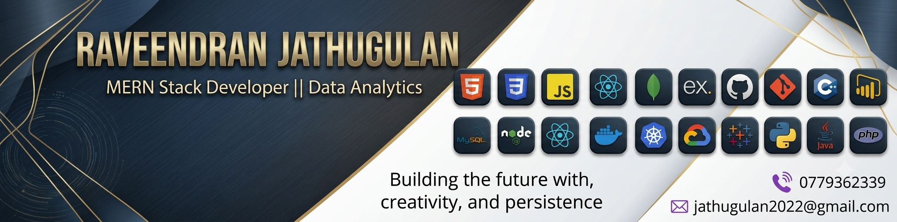

# 🚀 Raveendran Jathugulan — Full Stack Developer Portfolio

<div align="center">



[](https://github.com/Jathugulan)
[](https://www.linkedin.com/in/raveendran-jathugulan/)
[](https://jathugulan.github.io/)
[](mailto:jathugulan2022@gmail.com)

**Premium Full Stack Developer Portfolio — Static, Fast, GitHub Pages Ready**

</div>

---

## 📋 Table of Contents

- [Overview](#-overview)
- [Live Demo](#-live-demo)
- [Features](#-features)
- [Tech Stack](#-tech-stack)
- [Project Structure](#-project-structure)
- [Sections](#-sections)
- [Featured Projects](#-featured-projects)
- [Certifications](#-certifications)
- [Performance](#-performance)
- [Accessibility](#-accessibility)
- [SEO](#-seo)
- [Deployment](#-deployment)
- [Contact](#-contact)

---

## 🌟 Overview

A modern, premium **Full Stack Developer Portfolio** built as a fully static website using pure **HTML5**, **CSS3**, and **ES6+ JavaScript** — no frameworks, no build tools, no npm required. Designed for immediate GitHub Pages deployment and optimized for recruiter review.

> 🎯 **Goal:** Present a clean, professional, and interactive portfolio that demonstrates real engineering capability and reflects modern 2026/2027 web design standards.

---

## 🔗 Live Demo

**[https://jathugulan.github.io/](https://jathugulan.github.io/)**

---

## ✨ Features

### 🎨 Design & UI

- **3D Interactive Hero Card** with Vanilla Tilt parallax, animated profile ring, and floating tech badges
- **Glassmorphism UI** with backdrop-filter blur, surface layers, and subtle borders
- **Dark / Light Mode** toggle, persisted in `localStorage`
- **Animated ambient background** with radial gradient blobs and a dot grid overlay
- **Smooth scroll progress bar** and visible section active indicator
- **Micro-animations** throughout (hover lifts, gradient shifts, staggered AOS reveals)
- **Typed.js** role animation cycling through developer titles

### 🗂️ Sections

- 9 fully separated sections with scroll-spy active state in the navbar
- Dedicated **Experience timeline**, **Education card**, **Skills explorer**, **Projects grid**, **Certifications gallery**, **Resume download**, and **Contact form**

### 🖼️ Projects & Galleries

- **3-column project grid** (2 on tablet, 1 on mobile) with category filter pills
- **Swiper.js screenshot lightbox** with keyboard navigation, touch swipe, slide counter, and ESC close
- **Real project thumbnails** from `assets/projects/` — no placeholder images
- **Direct GitHub repository links** on every project card

### 📬 Contact Form

- **EmailJS integration** for server-free form submission
- Client-side validation with inline error messages and toast notifications
- Graceful degradation if EmailJS is unavailable

### ⚡ Performance

- **Instant first paint** — zero preloaders or artificial loading delays
- `loading="lazy"` and `decoding="async"` on all non-critical images
- Eager loading only for the profile photo in navbar and hero
- CDN failure protection — any failing optional library gracefully degrades

### ♿ Accessibility

- Semantic HTML5 elements (`<header>`, `<main>`, `<section>`, `<footer>`, `<article>`, `<nav>`)
- `aria-label`, `aria-expanded`, `aria-controls`, `role`, `aria-modal`, and `aria-live` attributes throughout
- Keyboard navigation for modals (ESC to close, Tab focus trapping intent)
- Visible `:focus-visible` indicators
- Full support for `@media (prefers-reduced-motion: reduce)`

---

## 🛠️ Tech Stack

### Core

| Technology | Purpose |
|---|---|
| HTML5 | Semantic page structure |
| CSS3 | Design system, animations, layout |
| JavaScript ES6+ | Logic, DOM, event handling |

### CDN Libraries

| Library | Version | Purpose |
|---|---|---|
| [Bootstrap](https://getbootstrap.com/) | 5.3.3 | Responsive grid utilities |
| [Font Awesome](https://fontawesome.com/) | 6.5.2 | Icon set |
| [AOS](https://michalsnik.github.io/aos/) | 2.3.4 | Scroll-triggered animations |
| [Typed.js](https://mattboldt.com/demos/typed-js/) | 2.1.0 | Hero role typing effect |
| [Vanilla Tilt](https://micku7zu.github.io/vanilla-tilt.js/) | 1.8.1 | 3D tilt interaction on cards |
| [Swiper.js](https://swiperjs.com/) | 11 | Project screenshots lightbox |
| [EmailJS](https://www.emailjs.com/) | 4 | Client-side email form |
| [Google Fonts](https://fonts.google.com/) | — | Space Grotesk, Inter, JetBrains Mono |

---

## 📁 Project Structure

```
portfolio/
├── index.html                      # Main portfolio (single-page)
├── README.md                       # This file
│
└── assets/
    ├── profile/
    │   └── profile.jpg             # Developer profile photo
    │
    ├── projects/
    │   ├── mern/
    │   │   ├── vadamarutham/       # thumbnail.webp + screenshots 01-04
    │   │   ├── blood-donation/     # thumbnail.webp + screenshots 01-04
    │   │   ├── tholan-bookshop/    # thumbnail.webp + screenshots 01-04
    │   │   ├── teacher-payroll/    # thumbnail.webp + screenshots 01-04
    │   │   ├── quizmaster-pro/     # thumbnail.webp + screenshots 01-04
    │   │   └── quickride/          # thumbnail.webp + screenshots 01-04
    │   ├── php/
    │   │   ├── alumni-management/    # thumbnail.webp
    │   │   └── yarl-skill-hub/       # thumbnail.webp
    │   └── dotnet/
    │       └── pharmanova/
    │           ├── pharmanova.webp       # thumbnail
    │           └── Home.webp             # screenshot
    │
    ├── certificates/
    │   ├── full-stack/             # Full Stack certificates (.jpg + .pdf)
    │   ├── mern/                   # MERN Stack certificates
    │   ├── mean/                   # MEAN Stack certificates
    │   ├── web-development/        # Web Development certificates
    │   ├── ai-ml/                  # AI & Machine Learning certificates
    │   ├── devops/                 # DevOps certificates
    │   ├── innovation/             # Innovation & Mindset certificates
    │   ├── technology/             # JavaScript, programming certificates
    │   ├── sql/                    # SQL & Database certificates
    │   ├── python/                 # Python certificates
    │   └── java/                   # Java certificates
    │
    ├── resume/
    │   └── Raveendran-Jathugulan-Resume.pdf
    │
    ├── technologies/               # SVG tech logos for Skills section
    ├── icons/                      # Favicon assets
    └── og/
        └── og-banner.png           # Open Graph social preview image
```

---

## 📂 Sections

| # | Section | Description |
|---|---|---|
| 1 | **Home / Hero** | 3D interactive profile card, Typed.js role animation, CTAs |
| 2 | **About** | Bio, engineering pillars, animated stats (9+ projects, 2 internships, 20+ technologies) |
| 3 | **Experience** | Vertical timeline — Pantech.AI (3-month) & NoviTech R&D (1-month) internships |
| 4 | **Education** | BICT Hons — University of Vavuniya, Faculty of Technological Studies (2023–Present) |
| 5 | **Skills** | Categorized explorer across Languages, Frontend, Backend, Databases, Tools, DevOps, APIs, Soft Skills |
| 6 | **Projects** | Filter-driven grid with real thumbnails, GitHub links, and screenshot lightbox |
| 7 | **Certifications** | Filter-driven gallery with 15+ verified credentials, PDF view/download, and image preview |
| 8 | **Resume** | Direct download and PDF view of ATS-friendly resume |
| 9 | **Contact** | EmailJS form, copyable email/phone, and social links |

---

## 💼 Featured Projects

| Project | Stack | Repository |
|---|---|---|
| Vadamarutham Restaurant | React, Node, MongoDB, Leaflet | [GitHub](https://github.com/Jathugulan/vadamarutham-restaurant) |
| Blood Donation Emergency Matcher | MERN, TypeScript, Socket.IO | [GitHub](https://github.com/Jathugulan/blood-donation-emergency-matcher) |
| Tholan Book Shop | React, Redux Toolkit, Express, MongoDB | [GitHub](https://github.com/Jathugulan/tholan-book-shop) |
| TeacherPayRoll ERP | MERN, JWT, Google OAuth | [GitHub](https://github.com/Jathugulan/TeacherPayRollERP) |
| QuizMaster Pro MERN | React, Vite, Node, MongoDB | [GitHub](https://github.com/Jathugulan/quizmaster-pro-mern) |
| QuickRide Vehicle Rental | MERN, Mongoose, REST API | [GitHub](https://github.com/Jathugulan/quickride-vehicle-rental-booking) |
| Alumni Management System | PHP, MySQL, Bootstrap 5 | [GitHub](https://github.com/Jathugulan/Alumni-Management-system) |
| Yarl Skill Hub | HTML5, CSS3, JavaScript, Bootstrap, PHP, MySQL, AJAX, Chart.js | [GitHub](https://github.com/Jathugulan/yarl-skill-hub) |
| PharmaNova | C#, .NET Framework, SQL Server | [GitHub](https://github.com/Jathugulan/PharmaNova) |

---

## 🏆 Certifications

- 30 Days MasterClass in Full Stack Development — **NoviTech R&D**
- Full Stack Web Development Internship — **Pantech.AI**
- Full Stack Development — **Simplilearn**
- Introduction to MERN Stack — **Simplilearn**
- Web Design for Beginners — **University of Moratuwa**
- Professional Certificate in DevOps — **Udemy**
- Artificial Intelligence — **Pantech.AI**
- Machine Learning — **Pantech.AI**
- I2OR Young Innovator Mindset Certification — **I2OR**
- Introduction to JavaScript — **Sololearn**
- Introduction to SQL — **Sololearn**
- Introduction to Python — **Saylor Academy**
- Java (Basic) Certificate — **HackerRank**

---

## ⚡ Performance

- **Instant first paint** — no preloaders, no blocking JavaScript
- `loading="lazy"` + `decoding="async"` for all non-critical images
- CDN libraries do not block page visibility if they fail
- Scroll progress bar, back-to-top, and AOS are pure performance-safe additions

---

## ♿ Accessibility

- Full semantic HTML5 structure
- ARIA attributes on all interactive elements
- Keyboard navigation support (modals, menu, buttons)
- Focus-visible indicators
- Reduced motion support via `prefers-reduced-motion`

---

## 🔍 SEO

- Descriptive `<title>` and `<meta name="description">`
- Open Graph and Twitter Card meta tags
- Single `<h1>` per page with proper heading hierarchy (`h1` → `h2` → `h3`)
- Canonical URL
- `rel="noopener noreferrer"` on all external links

---

## 🚀 Deployment

### Local Development

No build step required. Simply serve the `portfolio/` folder:

```bash
# Python (built-in)
python -m http.server 8080

# Node.js (npx serve)
npx serve .

# VS Code Live Server
# Right-click index.html → "Open with Live Server"
```

Then open **http://localhost:8080** in your browser.

### GitHub Pages

1. Push the contents of this folder to a GitHub repository named `<your-username>.github.io`
2. Go to **Settings → Pages → Source** and set the branch to `main` (root `/`)
3. Your portfolio will be live at `https://<your-username>.github.io/`

> **Note:** The site is fully static — no server, no npm, no build process required.

### Custom Domain (Optional)

Add a `CNAME` file in the repository root:

```
yourcustomdomain.com
```

Then configure your domain's DNS with a CNAME record pointing to `<your-username>.github.io`.

---

## 📬 EmailJS Setup

To activate the contact form email delivery:

1. Create a free account at [emailjs.com](https://www.emailjs.com/)
2. Create an **Email Service** and note the **Service ID**
3. Create an **Email Template** and note the **Template ID**
4. Copy your **Public Key** from Account → API Keys
5. Update the constants in `index.html`:

```javascript
const EMAILJS_PUBLIC_KEY  = 'your_public_key_here';
const EMAILJS_SERVICE_ID  = 'your_service_id_here';
const EMAILJS_TEMPLATE_ID = 'your_template_id_here';
```

---

## 📞 Contact

| Channel | Details |
|---|---|
| 📧 Email | [jathugulan2022@gmail.com](mailto:jathugulan2022@gmail.com) |
| 📱 Phone / WhatsApp | +94 779362339 |
| 📍 Location | Point Pedro, Jaffna, Sri Lanka |
| 💼 LinkedIn | [raveendran-jathugulan](https://www.linkedin.com/in/raveendran-jathugulan/) |
| 🐙 GitHub | [Jathugulan](https://github.com/Jathugulan) |

---

<div align="center">

**© 2026 Raveendran Jathugulan · All Rights Reserved**

*Full Stack Developer · MERN Stack · Sri Lanka*

⭐ **If you found this portfolio useful or inspiring, please consider giving the repository a star!**

</div>
